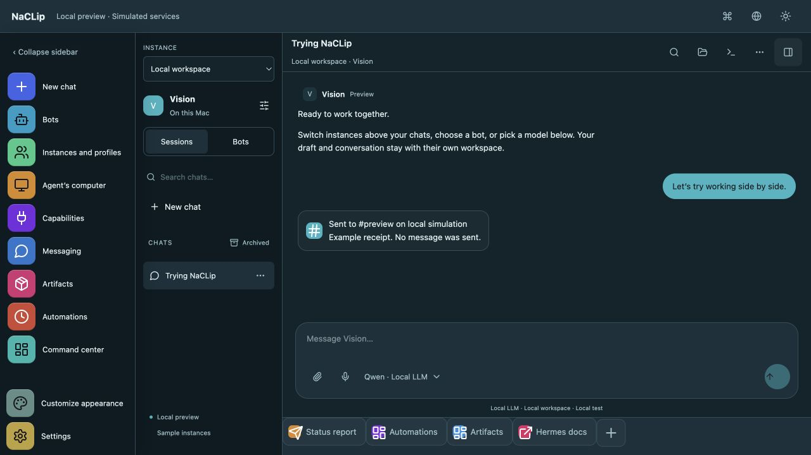
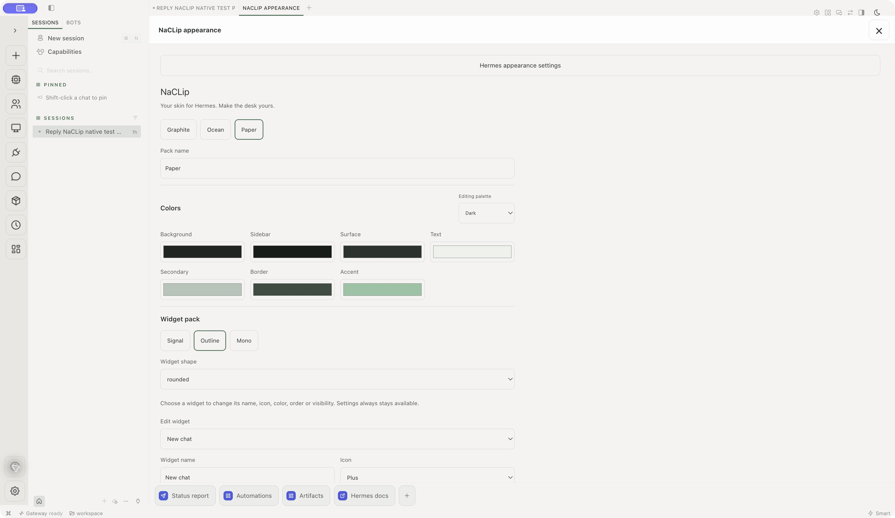

<div align="center">

# NaCLip

**Your skin for Hermes. Make the desk yours.**

A customizable Hermes Desktop plugin by **ASV Labs**.

**[Visit the NaCLip landing page →](https://asv-labs.github.io/naclip/)**

[](https://github.com/ASV-Labs/naclip/actions/workflows/checks.yml)
[](LICENSE)

[Website](https://asv-labs.github.io/naclip/) · [Install](#install-in-hermes-desktop) · [Screenshots](docs/SCREENSHOTS.md) · [Customization](docs/APPEARANCE.md) · [Sharing](docs/SOCIAL-SHARING.md) · [Verification](docs/RELEASE-AUDIT.md)

</div>

NaCLip adds themes, customizable navigation widgets and appearance tools to your existing Hermes Desktop. Choose **Graphite, Ocean or Paper**, switch light/dark with the sun/moon control, and make the workspace feel like yours.

Hermes continues to run your agents, models, conversations, tools and connections. NaCLip uses its desktop plugin SDK; it does not replace or patch the Hermes application or backend. Your providers and local LLMs remain configured through Hermes.

**Verified in actual Hermes Desktop on macOS:** the plugin loaded, applied themes, persisted widget choices and worked alongside a real **Grok 4.7** reply. Native Files opened a disposable workspace document, and native Terminal ran its sample Python script. This is an **experimental release** with a scoped integration test, not full cross-platform acceptance. [See exactly what passed and what remains pending →](docs/RELEASE-AUDIT.md)

### A look inside

**Ocean · browser preview.** Expanded widget labels and the chat layout. Conversations, model entries and service responses here are simulated; the native host retains its own session and model controls.

[](docs/screenshots/preview-ocean.png)

**Paper · actual Hermes Desktop.** NaCLip’s native appearance editor, widget treatment and persistent close control.

[](docs/screenshots/native-appearance-paper.png)

[Open the screenshot gallery, including the working native terminal →](docs/SCREENSHOTS.md)

## Install in Hermes Desktop

You need an existing Hermes Desktop build with the compatible desktop plugin SDK. The tested baseline is **macOS arm64**, Hermes source commit [`54bc5e509c98`](https://github.com/NousResearch/hermes-agent/commit/54bc5e509c985f37265c3d416bd2c64b10fc77ba). SDK compatibility can vary between releases.

1. Open **Capabilities → Plugins** in Hermes Desktop.
2. Choose **Install from Git** and paste:

   ```text
   https://github.com/ASV-Labs/naclip
   ```

3. Enable **NaCLip**.
4. Open the **Customize appearance** palette widget above Settings, or run **NaCLip: Customize appearance** from Hermes’s command palette.
5. Choose a theme and widget pack, then click **Apply appearance**. Use the top-right **X** to return to your chat.

The root [`plugin.js`](plugin.js) is the installable entry. **No npm build or Docker installation is needed for the skin.** The native smoke test staged this entry in a dedicated test home and enabled it successfully; the Git-install dialog itself has not yet been tested end to end.

Prefer testing away from your daily agent first? Follow [the isolated native test guide](docs/NATIVE-TEST.md). A separate app copy, Hermes home, backend, auth store and workspace protect the test boundary; changing only Electron’s user-data directory is insufficient.

### Updating

NaCLip checks GitHub for a newer version about twice a day and shows an **Update** notification in Hermes when one is published. The check is one request for this repository's [`version.json`](version.json), sent without cookies or a referrer. You can turn it off, or check by hand, at the top of **NaCLip appearance** or with **NaCLip: Check for updates** in the command palette.

To update, choose **Update**. NaCLip copies the repository link and opens **Capabilities → Plugins**. Choose **Install from Git**, paste the link, and install; Hermes replaces NaCLip in place. If you installed by copying `plugin.js` by hand, replace that file with the new [`plugin.js`](plugin.js). Your theme, widgets and shortcuts are kept either way.

**0.4.2** fixes **Swap sidebar sides** working only once, the widget rail and shortcut dock seams stretching across the window, resize lines crossing the window controls, tabs sliding under the traffic lights after a swap, and the glass backdrop, expanded widget sidebar and tooltips staying on the wrong side.

### Setup and recovery

- **Missing or overlapping panes:** save your preferred arrangement, then use **Reset layout** in Hermes’s command palette. This resets pane placement.
- **Blank native terminal:** open **Layout editor → Advanced → Terminal deck → Done**. This activated the native shell on the tested build. See [native terminal troubleshooting](docs/NATIVE-TEST.md#native-files-and-terminal).
- **Return to core Hermes:** disable NaCLip in Capabilities → Plugins. Select a core theme in Settings → Appearance → Theme if needed.
- **Upgrading an earlier Tandem installation:** disable or remove that copy first. The internal plugin ID remains `tandem` for saved-setting compatibility.

## Make it yours

| Customize | Options |
| --- | --- |
| Theme | Graphite, Ocean and Paper, each with light and dark palettes |
| Colors | Backgrounds, surfaces, text, borders and accent colors |
| Widget pack | Signal, Outline or Mono; rounded, circle or square tiles |
| Navigation | Hover names, expanded labels, widget names/icons/colors, ordering and visibility |
| Custom widgets | Shortcuts to supported pages, chat prompts or HTTP(S) links |
| Share a pack | JSON import/export with a review draft before applying |
| Create with your agent | Draft a theme brief in the current chat, review the returned JSON, then import it |

Settings stays accessible. Appearance packs change presentation and navigation; they do not change provider credentials, models or agent configuration. Agent-generated pack acceptance remains pending. [Appearance and widget pack guide →](docs/APPEARANCE.md)

## Browser preview

Try the interface locally without installing Hermes:

```sh
git clone https://github.com/ASV-Labs/naclip.git
cd naclip/localhost-preview
npm ci
npm run dev
```

Use Node **20.19+ or 22.12+** supported by Vite. Open [http://127.0.0.1:14327/](http://127.0.0.1:14327/); keep the terminal running and press Ctrl+C to stop it. The server binds to loopback only.

The preview uses simulated chats and sample provider catalogs, including OpenAI, Anthropic, Grok, Gemini and local LLM examples. Its redesigned capability explorer adds search, filters and sorting. Optional **real macOS Files and Terminal** access requires explicit actions and Xcode Command Line Tools; it is a development companion, not the Hermes backend. [Preview guide](docs/PREVIEW.md) · [Files/Terminal setup and access limits](docs/LOCAL-WORKSPACE.md)

## Does the agent’s computer need Docker?

**Only if you choose Hermes’s Docker-backed computer sandbox.** The skin, themes, native Files and local Terminal do not require Docker. With a remote Docker backend, the engine runs on that backend host. A supported Linux Bot Screen can also work without Docker.

The computer pane needs a configured Hermes screen backend. Our isolated test correctly showed an unsupported/unconfigured notice; **a live Docker/RFB screen has not been verified**. [Computer sandbox requirements and setup →](docs/COMPUTER-SANDBOX.md)

## Documentation

| Guide | What you will find |
| --- | --- |
| [Screenshots](docs/SCREENSHOTS.md) | Labeled native and preview captures; click for full size |
| [Appearance](docs/APPEARANCE.md) | Themes, widget packs, custom widgets and JSON schema |
| [Native testing](docs/NATIVE-TEST.md) | Independent setup, launcher, recovery and acceptance checklist |
| [Browser preview](docs/PREVIEW.md) | Sample capabilities, settings and chat archive/delete controls |
| [Local Files and Terminal](docs/LOCAL-WORKSPACE.md) | Permission flow, macOS requirements, shell access and revocation |
| [Computer sandbox](docs/COMPUTER-SANDBOX.md) | Docker and other screen backend options |
| [Hermes feature audit](docs/HERMES-PARITY.md) | Coverage and the native/prototype boundary |
| [Release audit](docs/RELEASE-AUDIT.md) | Actual native results and remaining acceptance work |
| [Validation](docs/VALIDATION.md) | Offline checks and their scope |

## Development

```sh
cd localhost-preview
npm ci
npm test
npm run build
cd ..
node tandem/scripts/check-routing.mjs
node tandem/scripts/check-appearance.mjs
node tandem/scripts/check-workspaces.mjs
node tandem/scripts/check-layout.mjs
PYTHONDONTWRITEBYTECODE=1 python3 scripts/test-launcher.py
```

`plugin.js` contains the native plugin; `localhost-preview/` contains the React/Vite demonstration and local companion; `scripts/` contains the isolated macOS launcher. GitHub Actions runs the offline checks. [Validation details](docs/VALIDATION.md)

Provider credentials, account state, real conversations, app binaries and local test directories are excluded from this repository. Android and iOS clients are a separate future project.

## License and credits

[MIT](LICENSE) · [Third-party notices](THIRD-PARTY-NOTICES.md). NaCLip is an independent ASV Labs project. [Hermes Agent](https://github.com/NousResearch/hermes-agent) and its logos belong to [Nous Research](https://nousresearch.com/); use here identifies compatibility, not affiliation or endorsement. Hermes and Docker retain their own licenses and requirements.
