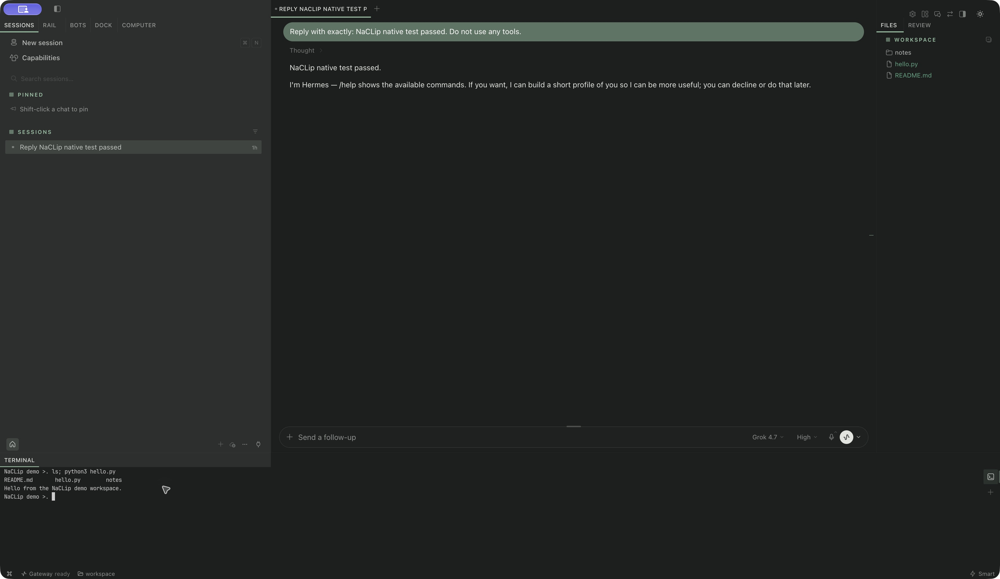

# NaCLip screenshots

Captured October 2, 2026, from the running interface. Click any image for full size. Native captures use an isolated Hermes Desktop test instance and disposable sample files.

## Ocean: browser preview

Expanded widget navigation and the Ocean dark palette. This is the React/Vite preview: chats, model catalogs and service responses are simulated. It is not a screenshot of a replacement native Hermes roster.

## Paper: native appearance editor

The actual NaCLip plugin running in Hermes Desktop on macOS arm64. Paper light is applied; the editor shows the pack’s separately editable dark palette and Outline widgets. The X remains visible at the top right.

## Native chat, Files and Terminal

Hermes’s Terminal deck layout, with NaCLip’s Paper dark palette. The chat contains a real Grok 4.7 smoke-test reply. Files lists `README.md`, `hello.py` and `notes` in the test workspace. The native terminal lists those files and executes `hello.py`, producing **Hello from the NaCLip demo workspace.** The shell prompt was set to a demo label before capture; the screenshot is otherwise unedited.

The Files pane also opened the sample README in Hermes’s editor. The terminal initially stayed blank in a different pane arrangement; choosing **Layout editor → Advanced → Terminal deck → Done** activated the shell. See [native setup and recovery](NATIVE-TEST.md#native-files-and-terminal).

These screenshots do not demonstrate a live Docker computer, voice, every provider or full native parity. [Verification scope](RELEASE-AUDIT.md) · [Back to installation](../README.md#install-in-hermes-desktop)
