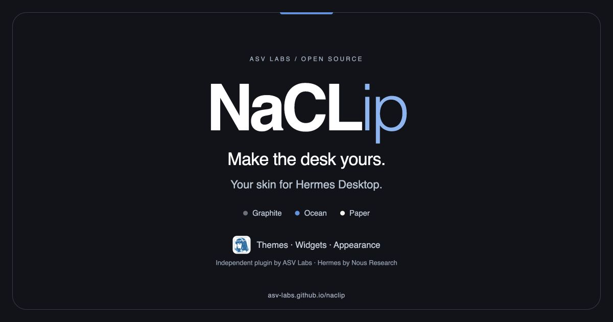

# Share NaCLip

Use **[https://asv-labs.github.io/naclip/](https://asv-labs.github.io/naclip/)** for the landing page.

The initial HTML includes complete Open Graph fields and explicit `twitter:card=summary_large_image` metadata. Both point to a versioned, same-origin 1200×630 JPEG with the NaCLip name, its Hermes Desktop purpose and ASV Labs attribution. This avoids relying on the favicon or a full-size app screenshot.

## Instagram artwork

For an Instagram post or Story, upload the artwork directly and add the website destination using the posting format's supported link controls. An automatic link card is not guaranteed in every Instagram placement. The Story design leaves room below the message for a Link sticker.

- [Instagram post image, 1080×1350](../landing/assets/naclip-instagram-post.jpg)
- [Instagram Story image, 1080×1920](../landing/assets/naclip-instagram-story.jpg)
- [Wide link card, 1200×630](../landing/assets/naclip-social-7fbca8aafd26.jpg)

## Verification and caches

Build validation passed: one metadata set, canonical URL, source-aligned title/description, raster signature, exact dimensions and SHA-256. The wide card and central square crop were visually inspected. CI checks the metadata and asset on every build.

Live verification on 2026-10-02:

- Normal client, Twitterbot, facebookexternalhit and meta-externalagent: page and exact card image returned **HTTP 200**. Initial metadata matched the manifest; image MIME, dimensions and hash matched.
- X Card Validator: **Page fetched successfully**, **summary_large_image found**, **Card loaded successfully**.
- **Actual X composer:** the canonical URL rendered the new large NaCLip image and title. The temporary test draft was discarded; no post was published.
- Threads and Instagram composer previews: not exercised. Their crawler-compatible metadata is deployed; Instagram artwork is supplied for direct image uploads.
- GitHub repository social preview: managed separately by GitHub. Its settings screen requires a browser GitHub login; the landing-page card is verified at the website URL above.

Deployment: [GitHub Pages run](https://github.com/ASV-Labs/naclip/actions/runs/37090297690). Metadata and assets: commit `3972a6a`. Crawler GET success is separate from a platform-rendered composer card. Old shares may retain an earlier cached preview; replacing source metadata is not proof an existing post changed. No social posts were published during this work.

The repository URL uses GitHub's own social preview settings, independent of the landing page HTML. Its configuration is checked separately.

The authoring manifest is [social-preview.json](../landing/social-preview.json). Artwork source: [social-card.html](../scripts/social-card.html). The credited Hermes mark is covered by [third-party notices](../THIRD-PARTY-NOTICES.md).
